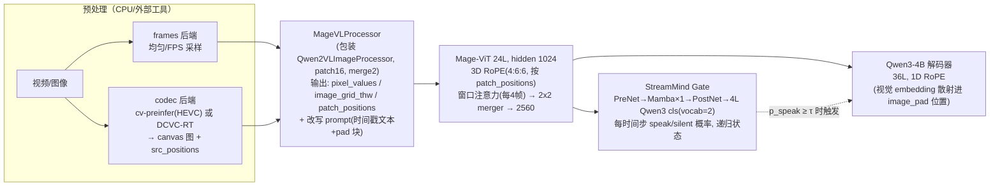
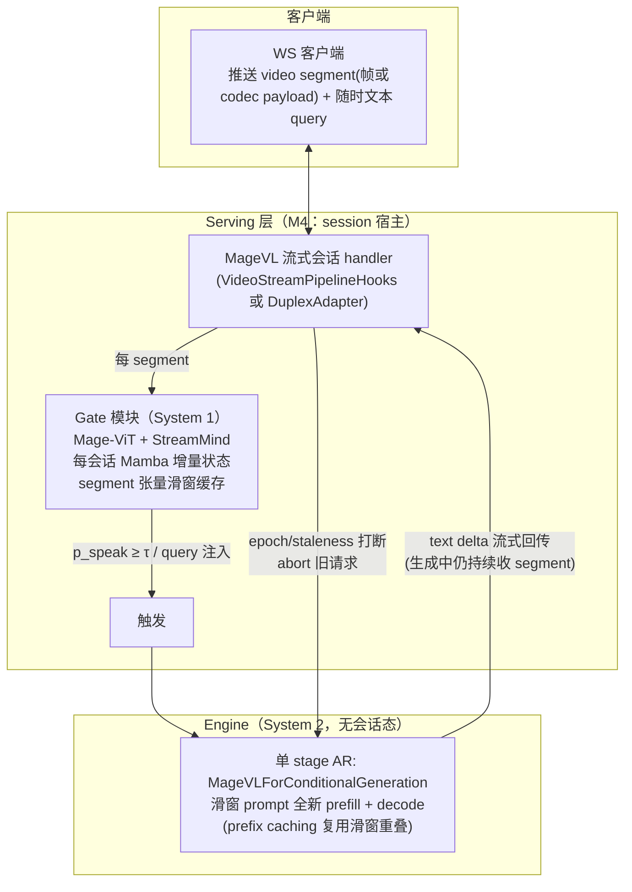

# Mage-VL（microsoft/Mage-VL）接入 vLLM-Omni 技术规格

> 对应 issue：[#5588 [New Model]: Add microsoft/Mage-VL with end-to-end full-duplex multimodal streaming inference](https://github.com/vllm-project/vllm-omni/issues/5588)
> 撰写日期：2026-08-18 · 基于 vllm-omni `main`（02069a5b 附近）、vLLM 目标版本 v0.27.0、transformers pin `>=5.10.1,<5.15`
> 模型来源：[HF microsoft/Mage-VL](https://huggingface.co/microsoft/Mage-VL) · [GitHub microsoft/Mage/mage_vl](https://github.com/microsoft/Mage/tree/8c94a0ac905167f40b05b09332b78752b7f9fbef/mage_vl) · [论文 arXiv:2607.24904](https://arxiv.org/abs/2607.24904)

---

## 0.0 实现状态（2026-08-18 更新）

**M1/M2 的图像与帧采样视频路径已实现并在 RTX 5090 上完成 parity 验收**（commit `2a8da5d4`）。已落地：`vllm_omni/model_executor/models/mage_vl/{vision,mage_vl,pipeline}.py`、`transformers_utils/{configs,processors}/mage_vl.py`、三处注册、`deploy/mage_vl.yaml`、8 条 CPU 单测。

实测结果（对照 HF 原生实现）：

| 验收项 | 结果 |
|---|---|
| 视觉塔 parity（fp32，同一份 bf16 权重升精度） | **rel_l2 4.19e-6 / cos 1.0000000000** —— 算法等价 |
| 视觉塔 parity（bf16，端到端） | cos 0.9998，rel_l2 2.0e-2；逐子模块二分显示 patch embedding / 两处 LayerNorm / GELU / rotary 表**差异恰为 0**，仅 attention kernel 有 1.3e-4（低于 bf16 单元素精度），24 层累积所致 |
| 权重加载 | 297/297 视觉塔参数、全模型无遗漏 |
| 离线生成 parity | **3/3 用例逐 token 完全一致**（greedy） |
| 在线 `/v1/chat/completions` | **3/3 逐 token 一致**；streaming 24 chunks 正常 |
| 视频（官方在线路径＝帧采样多图） | **逐 token 一致**；4 路并发输出唯一 |

> 关于 issue 中提到的 SSIM/PSNR：Mage-VL 是文本输出模型，不产图像，这两个指标不适用。上表采用的是更严格的等价指标——**逐 token 完全一致**（位级对齐，强于 SSIM 的感知级近似），并辅以 fp32 下的算子级 rel_l2。

尚未实现（按原计划顺延）：codec-native 输入（M3）、cognition gate 与主动流式（M4）、full-duplex（M5）。另：验证环境仅单卡，**TP>1 的一致性尚未实测**，M2 该项验收待多卡环境补齐。

---

## 0. TL;DR

Mage-VL = **Mage-ViT（自研 codec-native 视觉塔，约 0.3B）+ 标准 Qwen3-4B 解码器 + StreamMind 认知门控（独立 1.07GB 权重，Mamba 递归）**。两个对接入决定性的事实：

1. **LLM 侧是纯 Qwen3-4B、纯 1D RoPE（无 M-RoPE）**，视频经"image 别名"通道进入（`pixel_values`/`image_grid_thw`/`patch_positions`）。LLM 部分可以 100% 复用上游 vLLM 的 `Qwen3ForCausalLM`；需要新写的只有视觉塔（且其注意力/并行原语可全部取自上游 Qwen2.5/3-VL 组件）。
2. **跨 segment 的时间记忆全部保存在 gate 的 Mamba 状态里，LLM 每次响应只对"最近 codec segment 滑动窗口"做全新 prefill**（参考实现如此）。这意味着流式服务不需要 conversation-lifetime 的 LLM KV cache——gate（System 1）是有状态的小模型，LLM（System 2）是无状态的按需调用。这个结构与 vllm-omni full-duplex RFC（#3745）中 DUPLEX_VAD/System-1 stage 的设想同构，与 JoyVL / MiniCPM-o 4.5 已落地的三层 duplex 基建可以逐级对接。

推荐路线：**M1 单 stage 离线理解（frames 后端）→ M2 在线 serving + TP + CI → M3 codec-native 离线 parity → M4 gate + 主动流式（duplex `DuplexAdapter` 契约）→ M5 native full-duplex（T3 数据面）→ M6 性能与规模化**。

本 spec 受两条来自维护者的硬性约束支配，贯穿全文：

- **并行范围（§5）**：本次只交付 **TP**，其余并行轴（ViT-DP、TP 内 SP pass、PCP/DCP、Ulysses/Ring USP、CFG/HSDP/EP）**一律先不支持**，但必须"结构上留门"——即用上游标准并行原语与开关写代码，日后开启是改配置而非重构。
- **复用优先（§3.4）**：`load_weights`、TP 层、ViT 注意力等**必须复用上游/仓库既有组件，不得另起炉灶**；任何偏离都要按 `MODEL-INV-003` 显式记录理由。

对应地，serving 侧（§4.5）遵循仓库**当前**规范而非历史路径：声明式 `PipelineConfig` 插件字段 + duplex adapter 契约，**禁止**在共享 serving 模块里新增 per-model 分支或依赖模型名子串匹配。

---

## 1. 目标与范围

按 issue #5588 的要求，支持目标**不止于一次性图像/视频问答**，而是分阶段达到：

| # | 能力 | 里程碑 |
|---|------|--------|
| G1 | 离线图像 / 帧采样视频理解，与 HF 参考实现对齐 | M1 |
| G2 | 在线 OpenAI 兼容 serving（chat completions，多模态） + TP/SP 并行 | M2 |
| G3 | codec-native（H.264/HEVC 元数据、DCVC-RT）离线视频推理 parity | M3 |
| G4 | 有状态因果 segment 摄取 + cognition gate 事件触发输出（主动流式） | M4 |
| G5 | 端到端 full-duplex：生成期间持续接收输入、打断/过期输出处理、持久会话 | M5 |
| G6 | 正确性 / 延迟 / 长会话 / 打断 / 并发的测试与性能基线 | M2–M6 递进 |

非目标（明确排除）：
- 训练 / 微调支持；
- 为 AR stage 新建 Ulysses/Ring 序列并行引擎能力（见 §5.2 的界定）；
- 上游化到 vllm-project/vllm（可作为后续独立工作，本 spec 的模型实现方式与上游规范兼容，便于日后上提）。

---

## 2. 模型架构调研结论

### 2.1 组件总览



关键参数（来自 `config.json` 与源码）：

| 组件 | 参数 |
|------|------|
| `vision_config`（`model_type: mage_vl_vision`） | 24 层，hidden 1024，16 heads（head_dim 64），patch 16，`temporal_patch_size 1`，`spatial_merge_size 2`，`out_hidden_size 2560`，LayerNorm + GELU，`rope_theta 10000`，`frame_windows_size 4`，`use_head false` |
| `text_config`（`model_type: qwen3`，即 Qwen3-4B-Instruct-2507） | 36 层，hidden 2560，32 Q heads / 8 KV heads，head_dim 128，vocab 151936，`rope_theta 5e6`，`max_position_embeddings 262144`，全层 full attention，**无 `mrope_section`** |
| 特殊 token | `image_pad 151655`、`video_pad 151656`、`vision_start 151652`、`vision_end 151653`（与 Qwen2/2.5/3-VL 家族完全一致），eos `151645` |
| Gate（独立 `streammind_gate.safetensors`，1.07GB） | `PreNet(2560→2560)` → `VideoMamba`（1 个 `mamba_ssm` block，d_model 2560）→ `PostNet` → `ClsNet`（4 层 Qwen3，heads 32/8，intermediate 12288，**vocab_size=2**） |
| 权重 | 主模型 2 个 safetensors 共 ~9.5GB（bf16，约 4.3B 参数），gate ~0.5B |
| 代码形态 | `trust_remote_code=True`，`auto_map` 指向 repo 内 `modeling/processing/configuration/video_processing/codec_video_processing_mage_vl.py`；checkpoint 按 transformers 5.7 的 `@strict` dataclass config 风格编写 |

### 2.2 Mage-ViT：与 Qwen2-VL ViT 的同与异

结构上是 Qwen2-VL 风格的 flat-patch ViT（输入 `[total_patches, C, 16, 16]`，Qwen2VL processor 的 2×2 block 排列，merger 2×2→MLP→2560），但有以下**差异点 = 移植时的正确性清单**：

1. **3D RoPE 按显式 `patch_positions` 计算**（`VisionRotaryEmbedding.forward_from_positions`）：每个 patch 带 `(t,h,w)` 三元组；head_dim/2=32 维按 **4:6:6 切成 t:8 / h:12 / w:12**。`t` 坐标是**源视频真实帧号**（不是 0..T-1 稠密下标）——流式场景下后续 segment 的 t 单调增长，codec 后端下 P 帧 patch 稀疏分布。这是"codec-native 稀疏 token"的位置编码基础，**必须原样保留，不能退化成 grid_thw 推导**。
2. **rotate_half 是 interleaved（相邻偶奇对）约定**：`(x1,x2,x3,x4)→(-x2,x1,-x4,x3)`，与 vLLM/SGLang 默认的 half-split 约定 `cat(-x[half:], x[:half])` **数值不等价**。SGLang 移植（kcz358/sglang `feat/mage-vl` 分支）为此给 `VisionAttention` 传了自定义 `customized_position_embedding_applier`，且**旋转在 fp32 完成后回转原 dtype**。vLLM 移植同样需要自定义 apply 函数。
3. **窗口注意力靠 cu_seqlens 实现**：`_build_cu_seqlens` 把每个样本按 `frame_windows_size=4` 个时间步切成 varlen 段（余数单独一段），注意力只在段内。与上游 Qwen2.5/3-VL 的 `cu_seqlens` varlen 机制（`MMEncoderAttention`）**机制同构，直接可复用**，仅切分规则不同。
4. 编码器输出取 `encoder_outputs.hidden_states[-1]`（数值上等于最后一层输出；HF 代码注释写 "second-to-last" 但按其 hidden_states 收集顺序实际是最后层——parity 测试时逐层比对确认一次即可）。
5. merger 之外还有可选的 `use_patch_position_encoding`（绝对位置 embedding，当前 checkpoint 关闭）与 `use_head`（Siglip2 pooling head，关闭）——移植时按 config 门控即可，不必实现。

### 2.3 文本解码器：接入的最大简化点

`MageVLModel.forward` 中显式使用**简单 1D position_ids**（HF 源码注释 "Use simple 1D position_ids"），`text_config` 无 `rope_scaling.mrope_section` → vLLM 侧 `uses_mrope()` 为 False，走标准位置通道。**不需要实现 `get_mrope_input_positions`、不需要 M-RoPE 相关任何逻辑**。时序信息由两条通路补偿：ViT 内的 3D RoPE + prompt 里插入的 `<X.X seconds>` 时间戳文本。

另一个别名细节：HF 模型的 `forward` 只消费 `pixel_values`/`image_grid_thw`（`pixel_values_videos`/`video_grid_thw`/`second_per_grid_ts` 在该层未用），**视频张量由 processor 以 image 键名喂入**。SGLang 移植中 `get_video_feature = get_image_feature` 即此。

### 2.4 StreamMind Gate（System 1）

- 输入：**merger 之后的 vision tokens**（`[1, T, patches_per_t, 2560]`，与喂给 LLM 的是同一份表征）；每个时间步 patch 平均池化 → 一个 "EPFE" token。
- `VideoMamba`（`mamba_ssm.create_block`，1 层，支持 `inference_params` 递归推理）沿时间维滚动 → 每时间步经一个 4 层 Qwen3 二分类头输出 speak/silent logits。
- **状态语义**：Mamba SSM 状态就是"有界递归流式记忆"。参考实现 `streammind_gate_forward_segments` 一次性对全部 segment 重算，但 Mamba 天然支持增量（`inference_params` 携带状态跨调用）——**在线服务应实现增量模式**，每 segment 只前向新增时间步。
- 触发判定：在每个 segment 的**最后一个时间步**取 `softmax(logits)[:,1]` 作为 `p_speak`，`p_speak ≥ τ`（默认 0.5）触发 System 2。
- 依赖注意：`mamba_ssm` 是 CUDA 扩展包，仓库当前不依赖 → 必须按 optional-deps 模式处理（见 §7 风险）。

### 2.5 预处理与 prompt 格式

两个视频后端，共用输出协议（`pixel_values [ΣT·Hp·Wp, C,16,16]` + `image_grid_thw [N,3]` + `patch_positions [ΣT·Hp·Wp, 3]`）：

- **frames 后端**：decord/PIL 解帧（`num_frames`/`max_frames=384`/`target_fps`），`Qwen2VLImageProcessor(patch16, merge2, temporal_patch_size=1)`；`patch_positions` 的 t 用真实帧号。prompt 改写：每帧一个块
  `　<X.X seconds><|vision_start|><|image_pad|>×n<|vision_end|>`（`_expand_video_block_for_frames`，秒数 1 位小数）。
- **codec 后端**：外部工具产出"canvas"拼图 + `src_positions`：
  - `hevc` engine：外部 **cv-preinfer 二进制**（读取 H.264/HEVC 码流的 bit-cost/运动矢量/残差能量，选出 I 帧全部 patch + P 帧运动显著 patch，打包成 canvas）；
  - `dcvc-rt` engine：checkpoint 内附带的 `neural_codec/` 包 + `DCVC_INTRA_TAR`/`DCVC_INTER_TAR` 环境变量指定的 DCVC-RT 权重（GPU 打分）；
  - `CodecConfig`：`target_canvas 32 / group_size 32 / images_per_group 4 / max_pixels`（与 processor 像素预算统一）；全 padding 的 canvas 会被 drop；结果按视频 URL+配置 hash 落盘缓存（`ONLINE_CODEC_CACHE_DIR`）。
  - prompt 改写按 `patch_positions` 中连续相同 t 的 run 生成 `<X.XX seconds><|vision_start|><|image_pad|>×k<|vision_end|>\n`。
- chat template 是标准 Qwen ChatML（与 Qwen2-VL 相同），`<|video_pad|>` 占位在 processor 内被整体替换。

**接入含义**：所有 codec 复杂度都在 CPU/预处理侧，engine 内模型只看到统一的三元组张量协议——vLLM 侧的多模态 processor 边界天然吻合。

### 2.6 流式推理参考语义（决定 serving 架构的核心）

`inference_streaming.py` + 模型卡的语义：

1. 视频切成**不重叠 segment**（默认 8s），每个 segment 独立过 processor；
2. gate 沿全部 segment 连续滚动（Mamba 状态跨段），在每个 segment 边界产出 `p_speak`；
3. `p_speak ≥ τ` 的 segment → 用**当前 segment（脚本）/ 最近若干 segment 的滑动窗口（模型卡）** 构建 prompt，走一次**全新的标准 generate**（fresh prefill + decode）；
4. 文本 query 可在任意时刻注入。

推论（贯穿 §4/§5 的设计基石）：
- **LLM 不需要会话生命周期 KV**——它是按需、有界窗口、无状态调用；prefix caching 可跨触发复用滑窗重叠部分。
- **会话状态 = gate 的 Mamba 状态 + 最近 segment 的张量缓存（滑窗）+ 会话元数据**，量级小、易于按 `session_id` 管理。
- 单请求算力主要在触发时的 LLM prefill；gate 每 segment 的开销 ≈ 一次 ViT 前向（segment 稀疏 token）+ 0.5B 分类头一步，远小于 4B LLM。

### 2.7 已有 serving 先例：SGLang fork（对照基准）

[kcz358/sglang `feat/mage-vl`](https://github.com/kcz358/sglang/tree/feat/mage-vl)（官方 README 指定的 serving 方案）实现了**离线理解部分**（无 gate/流式）：
- `python/sglang/srt/models/mage_vl.py`：视觉塔复用 sglang `VisionAttention`（TP qkv + varlen 后端）+ 自定义 interleaved rotary applier + `build_cu_seqlens`；文本用 `Qwen3Model + ParallelLMHead`；
- `python/sglang/srt/multimodal/processors/mage_vl.py`：`patch_positions` 经 `MultimodalDataItem.model_specific_data` 透传到 `get_image_feature`；
- 权重重映射：`model.visual.*→visual.*`、`.self_attn.qkv.→attn.qkv_proj.`（vision qkv 在 ckpt 中是融合的单矩阵）、`model.language_model.*→model.*`。

这份代码可以直接作为 vLLM 模型定义的行为对照（含逐算子 parity 测试的第二参照系）。

### 2.8 checkpoint 权重格式核查（结论：**无需任何转换**）

已下载并解析 `model.safetensors.index.json` 逐项确认：

| 项 | 实测 |
|---|---|
| 格式 | **标准 HuggingFace transformers safetensors**（非 diffusers 布局，也非 `.bin`/pickle） |
| 分片 | `model-00001/00002-of-00002.safetensors` + `model.safetensors.index.json`，696 个张量，`total_size` 9,483,587,584（≈8.83 GiB，bf16） |
| 顶层键空间 | `model.language_model.*`（398）、`model.visual.*`（297）、`lm_head.weight`（1） |
| 语言塔命名 | 教科书式 Qwen3：`layers.N.self_attn.{q,k,v,o}_proj`、`self_attn.{q,k}_norm`（Qwen3 QK-norm）、`mlp.{gate,up,down}_proj`、`input_layernorm`、`post_attention_layernorm`、`embed_tokens`、`norm` |
| 视觉塔命名 | `embeddings.patch_embedding.weight`、`layernorm_pre.*`、`encoder.layers.N.{layer_norm1,layer_norm2,self_attn.qkv,self_attn.proj,mlp.fc1,mlp.fc2}`、`merger.{ln_q,mlp.0,mlp.2}` |
| **视觉 qkv 布局** | **融合单矩阵**且为 **`[all_q \| all_k \| all_v]` 块拼接**——由 HF 前向 `reshape(B, L, 3, H, D)`（`3` 为最慢变化维）确证，见 `modeling_mage_vl.py:424-430` |

**结论与决策**：

1. **不需要格式转换，也不需要转存到个人仓库。** "diffusers 格式"（`model_index.json` + `transformer/`、`vae/`、`text_encoder/` 等子目录）是扩散管线的组织方式，只被 `vllm_omni/diffusion/` 的加载器消费；Mage-VL 是 AR 理解模型，走的是 vLLM 的 `DefaultModelLoader` + `AutoWeightsLoader`——**该路径原生读取的就是上面这种 safetensors + index 布局**。把它转成 diffusers 格式反而会让标准加载器无法识别。
2. **视觉 qkv 的块拼接布局是个好消息**：它正好落在 `QKVParallelLinear.weight_loader` 的 `loaded_shard_id is None` 融合分支（`linear.py:1222-1236`，按 `[q_offset, k_offset, v_offset]` 切分）所要求的前提上。若 checkpoint 是按 head 交错的 `[q0 k0 v0 q1 k1 v1 …]`，则必须额外做去交错并按 MODEL-INV-003 记录——**已确认不是这种情况**，此风险出清。
3. **唯一需要留意的打包细节**：`streammind_gate.safetensors`（1.07 GB）**不在** `model.safetensors.index.json` 内，是 HF remote code 经 `hf_hub_download` 旁路加载的侧车文件（`modeling_mage_vl.py:973-1002`）。因此 vLLM 标准加载器**不会**加载它——这对 M4（gate 位于 serving 进程、自行加载）恰好合适。**只有**当 gate 未来下沉进 engine 内模型（M5 方案 B）时，才需要二选一：给 gate 单开一条加载路径，或制作一份把 gate 并入 index 的派生 checkpoint。**那是本 spec 中唯一可能需要个人仓库派生副本的场景。**
4. `trust_remote_code` 也不构成转存理由：§4.3 已决定把 config/processor vendored 进 `vllm_omni/transformers_utils/` 并注册，公开 checkpoint 可原样以 `trust_remote_code=False` 服务。

---

## 3. 复用盘点：需求 → 现有组件映射

### 3.1 上游 vLLM（v0.27）可直接复用

| Mage-VL 需求 | 上游组件 | 说明 |
|---|---|---|
| Qwen3-4B 解码器（TP、KV、CUDA graph、量化） | `vllm/model_executor/models/qwen3.py` `Qwen3ForCausalLM`/`Qwen3Model` | 经 `init_vllm_registered_model(...)` 挂到 `language_model` 前缀（mammoth_moda2 同款做法），零改动 |
| ViT 注意力（varlen + TP） | `qwen2_5_vl.Qwen2_5_VisionAttention` 为抄写范本（`:345-456`）；实际用 `MMEncoderAttention` + `QKVParallelLinear`/`RowParallelLinear` | cu_seqlens 机制同构；**只需换 cu_seqlens 构建规则**（RoPE 见下行，上游已覆盖） |
| interleaved rotary | ~~`ApplyRotaryEmb(is_neox_style=False)`~~ **不适用**：经实测三种上游形式均不匹配（余弦 0.57–0.85），需精确复刻 helper | 详见 §3.4.2 的实测表——这是 MODEL-INV-003 允许的"上游契约不足"情形 |
| ViT 并行模式（本次不启用） | `MultiModalConfig.mm_encoder_tp_mode`、`is_vit_use_data_parallel(num_heads)`、各线性层 `disable_tp=` | 带 `num_heads` 调用可获得"head 数不整除 TP 时自动告警+回退"；本次 TP-only，保持 `supports_encoder_tp_data=False` |
| 多模态处理框架 | `BaseMultiModalProcessor` / `ProcessingInfo` / `BaseDummyInputsBuilder` / `MULTIMODAL_REGISTRY.register_processor` + `PromptReplacement`/`PromptUpdateDetails.select_token_id` | 时间戳文本 + 变长 per-frame 块的展开走标准 prompt-update 协议 |
| 多模态 embedding 散射 | 继承 `SupportsMultiModal.embed_input_ids`（`interfaces.py:407-442`，已含 OOV 掩码路径） | **不要**直接调 `_merge_multimodal_embeddings`——它是私有符号，仅 deepstack 类自定义散射语义的模型才 import |
| 权重重映射 | `WeightsMapper`（`orig_to_new_prefix` / `orig_to_new_stacked`）+ `AutoWeightsLoader` | HF `model.visual.*`/`model.language_model.*` → vLLM 布局；语言塔 q/k/v 合并用 `orig_to_new_stacked`（`qwen3_vl.py:530-537`），**不用**旧式手写 `stacked_params_mapping` 循环 |
| 会话式增量 prefill（M5 备选） | `RequestStatus.WAITING_FOR_STREAMING_REQ` + `Scheduler._update_request_as_session`（KV 保留式 append，mm offset 自动重定位） | 上游已支持"追加 token 只增量 prefill"，omni 在其上有 append/replace 双分支 |
| AR 序列并行 / 长上下文并行 | `PassConfig.enable_sp`、`ParallelConfig.prefill_context_parallel_size` / `decode_context_parallel_size` | **本次不做**（§5.2），仅登记存在性以备后续 |
| 严格权重加载检查 | `DefaultModelLoader.load_weights` / `track_weights_loading`（`model_loader/default_loader.py:415-471`） | 未加载参数直接 `ValueError`；本模型必须返回 `set[str]` 而非 `None` |

### 3.2 vllm-omni 可直接复用

| 需求 | 组件 | 精确位置 |
|---|---|---|
| 模型注册（双注册面） | `_OMNI_MODELS` + `register_omni_models_to_vllm()`（vLLM plugin 入口，`vllm serve` 裸用也生效） | `vllm_omni/model_executor/models/registry.py`；`pyproject.toml [project.entry-points."vllm.general_plugins"]` |
| 自定义 HF config/processor 免 trust_remote_code | `_register_omni_hf_configs()` + `vllm_omni/transformers_utils/{configs,processors}/` | `vllm_omni/engine/arg_utils.py:48`；AURA 的教训：remote config 类过不了 vLLM 的类型检查，必须 vendor |
| 单 stage AR pipeline 模板 | `MAMMOTH_MODA2_AR_PIPELINE`（`stage_id=0, LLM_AR, final_output_type="text", owns_tokenizer, requires_multimodal_data`）+ 14 行 deploy yaml | `vllm_omni/model_executor/models/mammoth_moda2/pipeline.py:51`；`vllm_omni/deploy/mammoth_moda2_ar.yaml` |
| “基于上游 VL 类做薄壳”的先例 | AURA：59 行 subclass `Qwen3VLForConditionalGeneration` 解决 config/processor 兼容 | `vllm_omni/model_executor/models/aura_omni/qwen3_vl.py` |
| 流式视频 WS 端点（**降级为备选**，见 §4.5.0） | `OmniStreamingVideoHandler` + `VideoStreamPipelineHooks`（`should_trigger_turn` / `build_engine_prompt` / `on_turn_complete`）；帧预热 mm_uuid 复用、`FrameSimilarityFilter`、soft-interrupt/abort。注意 `create_streaming_video_handler()` **不是**真正的分发点，而是硬编码 `return QwenOmniStreamingVideoHandler(...)` | `vllm_omni/entrypoints/openai/video_stream_base.py:71`、`serving_video_stream.py:135-151`；`docs/serving/video_stream_api.md` |
| Duplex 三层基建（M4/M5） | T1 sidecar（JoyVL）/ T2 `core.DuplexAdapter`（`proactive=True` + `should_respond()` 即逐窗门控）/ T3 native 数据面（`DuplexRuntimeExtension`：`configure_sampling_params`/`plan_append`/`decide_output`；`DuplexFence`；`session_mode: duplex` yaml；`DuplexSessionRuntimeConfig` 限额） | `vllm_omni/experimental/fullduplex/{core,engine,openai,joyvl,minicpmo45}/`；**必读** `experimental/fullduplex/DESIGN.md` 与 `README.md` |
| 逐步 logit 干预钩子（gate 强制静默/发声） | `prepare_duplex_sampling`（模型可选方法，runner 每步调用一次；`DuplexSamplingRow` 按行路由）；MiniCPM 的 force-listen 是现成参考 | `vllm_omni/worker/gpu_ar_model_runner.py:372,1504`；`models/minicpmo_4_5/minicpmo_4_5_omni.py:150` |
| “门控输出丢弃”先例 | AURA `<|silent|>` 哨兵词 + stage 输入处理器返回空 → orchestrator 终止空输出；JoyVL `</silence>`/`</response>`/`</delegation>` 决策词 + 去重策略 | `stage_input_processors/aura_omni.py`；`experimental/fullduplex/joyvl/decision/{output_parser,policy}.py` |
| 视频帧走 duplex 数据面的先例 | MiniCPM-o 4.5：`payload["video_frames"]`（base64 JPEG）、每帧 66 token 的调度预算、stage0 仅产 embeddings 不做 eager forward | `experimental/fullduplex/minicpmo45/{runtime,stage0,input}.py` |
| 增量 append vs 整段重 prefill 双分支 | `OmniARScheduler._update_request_as_session`：`meta.replace_streaming_prompt=True` → 重 prefill；否则 KV 保留 append | `vllm_omni/core/sched/omni_ar_scheduler.py:623`、`omni_scheduler_mixin.py:147` |
| 递归会话状态托管（gate Mamba 状态的远期归宿） | `StateObject`（两阶段 stage/commit，RFC #4480） | `vllm_omni/experimental/world_models/session_state/` |
| 测试/CI 框架 | L1–L4 marker 体系、`tests/e2e/features/<feature>/` 布局、`@hardware_test`、buildkite `source_file_dependencies`、import-boundary 测试、**按成功率而非单次布尔判定流式行为**（#5962 教训，commit `5664e69d`） | `pyproject.toml:252`、`docs/contributing/ci/test_writing_guide.md`、`tests/e2e/features/fullduplex/`、`.claude/skills/vllm-omni-test` |

### 3.3 仓库空白（需要新建的部分）

| 空白 | 定性 |
|---|---|
| Mage-ViT 视觉塔（positions 式 3D RoPE、interleaved rotary、4 帧窗口 cu_seqlens、LayerNorm/GELU、merger） | **全新模型代码**，但由上游并行原语拼装，SGLang 移植可对照 |
| `patch_positions` 的多模态字段透传 + 时间戳 prompt 展开 | vLLM prompt-update 框架内的新 processor 逻辑 |
| codec-native 输入预处理（cv-preinfer / DCVC-RT / canvas / 缓存） | 输入路径全仓库无任何先例（grep 确认 H.264/运动矢量仅存在于 diffusion 输出侧），**greenfield**，以 vendored 预处理模块 + optional deps 落地 |
| StreamMind gate 推理模块（mamba_ssm 依赖、增量状态、按会话管理） | 新模块；`mamba_ssm` 为新可选依赖 |
| 非 TP 的并行轴 | **本次一律不做**（§5）；composable_parallel 对 `sp_ulysses/sp_ring` 等保留轴显式抛 `AxisTranslationError` |

### 3.4 复用强制清单（Reuse Mandate）

> 规范依据（`docs/design/module/model_integration.md`，逐字引用）：
> - **MODEL-INV-001**：*"A model integration MUST declare how its model class, loader, input processor, and stage configuration are selected."*
> - **MODEL-INV-002**：*"Model-specific code MUST NOT select or invoke a downstream omni stage."*
> - **MODEL-INV-003**：*"An upstream vLLM implementation SHOULD be reused when its contract is sufficient; an override MUST document the behavioral difference."*

本节是 review 时的硬性核对表。**左列的每一项都必须使用中列的既有实现；右列是明令禁止的写法。**

#### 3.4.1 权重加载

**先决事实（已核对 checkpoint，见 §2.8）**：主权重是标准 HF transformers safetensors（2 分片 + index，696 个张量），视觉塔 qkv 融合且为 `[q|k|v]` 块拼接，语言塔是教科书式 Qwen3 命名。因此下表全部可直接落地，无需任何权重转换。

`load_weights()` 的**返回值是被强制检查的**：`vllm/model_executor/model_loader/default_loader.py:415-471` 用 `weights_to_load - loaded_weights` 求差，非空即 `ValueError: Following weights were not initialized from checkpoint`；返回 `None` 会**静默关闭**该检查——本模型不得返回 `None`，签名固定为 `def load_weights(self, weights: Iterable[tuple[str, torch.Tensor]]) -> set[str]`。

| 能力 | 必须复用 | 禁止 |
|---|---|---|
| checkpoint 前缀重映射（`model.visual.*`→`visual.*`、`model.language_model.*`→`language_model.model.*`、`lm_head.*`→`language_model.lm_head.*`） | `vllm.model_executor.models.utils.WeightsMapper`，以类属性 `hf_to_vllm_mapper` 声明（`orig_to_new_prefix`，值为 `None` 表示丢弃）。在库模板：`vllm_omni/model_executor/models/mammoth_moda2/mammoth_moda2.py:805-817` | 在 `load_weights` 里手写 `if name.startswith(...)` 的字符串裁剪链（SGLang 移植的 `map_hf_name` 是那边的写法，**不要照抄到 vLLM 侧**） |
| 整体加载入口 | 固定三行：`loader = AutoWeightsLoader(self)` → `return loader.load_weights(weights, mapper=self.hf_to_vllm_mapper)`。它自动为每个参数选对 `weight_loader`、自动加载持久 buffer、对未知 checkpoint 名直接 `ValueError` 并列出候选 | 手写 `params_dict = dict(self.named_parameters())` + 全量 for 循环（仓库内 `hunyuan_image3/siglip2.py:389-416` 是**反面教材**：它手写循环且对未知名 `continue`，等于废掉严格检查） |
| 侧车权重的排除 | `AutoWeightsLoader(self, skip_prefixes=[...])` 显式声明（gate 权重不在主 index 内，见 §2.8，正常情况下不会出现；如遇 checkpoint 变更需显式排除） | 用 `try/except` 或 `continue` 悄悄吞掉（`precheck-pr` 把权重加载路径上的宽 `except` 列为阻断项） |
| q/k/v、gate/up 的分片合并（**语言塔**：ckpt 是分离的 `q_proj/k_proj/v_proj`、`gate_proj/up_proj`） | `WeightsMapper(orig_to_new_stacked={"…q_proj.": ("…qkv_proj.", "q"), …})`——mapper 把 shard id 挂在张量上，`AutoWeightsLoader` 再分发给 `QKVParallelLinear.load_weights`。上游模板：`qwen3_vl.py:530-537` | 手写 `stacked_params_mapping` 三元组循环（旧写法，仍散见于库内老模型，新代码不要复制）；更不要自己 `torch.cat` 后塞进融合层 |
| **融合 qkv 单矩阵**（Mage-VL **视觉塔** `self_attn.qkv` 是一个 `[3*1024, 1024]` 矩阵） | 直接映射到 `QKVParallelLinear` 的参数，走其自带 `weight_loader` 的 `loaded_shard_id is None` 分支（`linear.py:1222-1236`），与上游 Qwen2/2.5-VL 视觉塔同型 | 先把融合矩阵在 CPU 上切成 q/k/v 再分别加载 |
| 子模块 loaded-params 前缀拼接 | `vllm_omni/model_executor/models/utils.py:63 add_prefix_to_loaded_weights(weights, prefix)` | 手写 set comprehension 拼前缀 |
| 层前缀命名 | `maybe_prefix(prefix, "...")` | 字符串拼接 |
| 语言塔实例化 | `init_vllm_registered_model(vllm_config=..., hf_config=config.text_config, architectures=["Qwen3ForCausalLM"], prefix=maybe_prefix(prefix, "language_model"))`（模板：`mammoth_moda2.py:663-668`） | 复制粘贴 Qwen3 的 decoder / attention / MLP 实现 |
| KV-scale 重映射（量化） | `maybe_remap_kv_scale_name` | 自行解析 scale 名 |
| RoPE `inv_freq` 缓冲区异常 | `vllm_omni/model_executor/models/utils.py:100 reinit_rotary_inv_freq(model, base, match=...)`——专治 `trust_remote_code` 自定义 RoPE 类以 `persistent=False` 注册的缓冲区加载后为脏值、首次 forward 出 NaN | 在 forward 里临时改写 `inv_freq` dtype。HF 参考实现为迁就训练期的 bf16 cast 这么做过（`modeling_mage_vl.py:1007-1020`、`streammind_gate.py:119-129`），**vLLM 侧必须在构造/加载期一次性定型，热路径不得改 buffer** |
| transformers 5.9+ `_keys_to_ignore_on_load_unexpected` list/set 兼容 | `vllm_omni/model_executor/models/utils.py:9 transformers_keys_to_ignore_compat()`（仅在确需 `trust_remote_code` 加载时，例如 gate 权重旁路） | 自行 monkey-patch transformers |

**验收**：`load_weights` 返回的 `loaded_params` 必须覆盖 `named_parameters()` 全集（显式声明丢弃的前缀除外）；M1 增一条断言"无遗漏、无多余键"的测试。

#### 3.4.2 TP 组件（视觉塔 + 语言塔）

Mage-ViT 的每一层都能在上游找到对位实现，**在库模板是 `vllm_omni/model_executor/models/hunyuan_image3/siglip2.py`**——一个已用上游并行原语写成的 ViT，其文件头注释（`siglip2.py:31-33`）即列出了该复用什么：

| Mage-ViT 部件 | 必须复用 | 位置 |
|---|---|---|
| qkv 投影 | `QKVParallelLinear` | `vllm.model_executor.layers.linear` |
| attention 输出投影 | `RowParallelLinear` | 同上 |
| MLP `fc1` / `fc2` | `ColumnParallelLinear` / `RowParallelLinear` | 同上 |
| merger MLP（4096→4096→2560） | `ColumnParallelLinear` + `RowParallelLinear` | 同上 |
| **varlen 窗口注意力**（cu_seqlens 分段） | `MMEncoderAttention`（`vllm.model_executor.layers.attention`），含后端自动选择与 `maybe_compute_seq_lens` / `maybe_recompute_cu_seqlens` / `compute_max_seqlen` 三个后端适配辅助（上游 `qwen3_vl.py:783-800` 是标准用法） | 上游 |
| TP world size / rank | `get_tensor_model_parallel_world_size()` / `get_tensor_model_parallel_rank()` | `vllm.distributed` |
| ViT 并行模式开关（**本次不启用，但结构留门**） | `is_vit_use_data_parallel()`（`vllm.model_executor.models.vision`）+ 并行线性层的 `disable_tp=` 参数，见 `siglip2.py:149-166,217-226` | 上游 |
| lm_head | `ParallelLMHead`（由 `Qwen3ForCausalLM` 自带，无需自建） | 上游 |

**禁止**：把上游注意力/线性层实现复制进本模型文件；自行实现 varlen mask 或直接调 flash-attn；用 `nn.Linear` 写视觉塔（会同时废掉 TP 与标准权重加载路径）。

**interleaved rotary：上游三种形式均不匹配，必须精确复刻（已数值实测判定）。**

初版 spec 曾断言可用 `ApplyRotaryEmb(is_neox_style=False)` 表达 Mage-VL 的交错 rotary。**该断言经 GPU 实测被证伪**，此处更正。原因是 Mage-VL 把两件事组合在了一起：

1. `rotate_half` 用相邻偶奇对交错（`modeling_mage_vl.py:329-337`）；
2. 但 cos/sin 是 **full head_dim**，由 `torch.cat([freqs, freqs], -1)` 得到（`modeling_mage_vl.py:888-889`）——于是同一对 `(2i, 2i+1)` 上的频率**不相等**。

而上游 `is_neox_style=False` 的定义是"每对共用一个频率"。二者因此不等价。实测（`L=37, H=4, D=64`，随机 q + 真实 freqs 构造）：

| 候选 | max_abs_diff | cosine |
|---|---|---|
| `ApplyRotaryEmb(is_neox_style=False)`，cos=半宽 freqs | 5.18e+00 | 0.6994 |
| `ApplyRotaryEmb(is_neox_style=True)`，cos=半宽 freqs | 4.75e+00 | 0.5718 |
| `is_neox_style=False`，cos 取 full freqs 偶数切片 | 5.20e+00 | 0.8531 |
| **精确复刻 helper** | **0.000e+00** | **1.0000** |

附带结论：该算子**不保范数**（‖q‖ 97.034 → 96.827），即它在数学上并非旋转，而是 checkpoint 训练时固化下来的特性——因此更不能用"标准 RoPE 变体"去近似，必须逐位复刻。

**按 MODEL-INV-003 必须书面记录的两处偏离**：
1. **rotary applier**：实现一个 `_mage_apply_rotary_emb(x, cos_full, sin_full)`，语义为 `x * cos + interleaved_rotate_half(x) * sin`，`cos/sin` 为 full head_dim。不使用上游 `ApplyRotaryEmb`——**因为上游契约不足以表达，而非为了图方便**（MODEL-INV-003 允许的正是这种情形）。
2. **cu_seqlens 构造规则**：按 `frame_windows_size=4` 切分（余数单独成段），而非上游按整图/整视频切分。复用 `MMEncoderAttention` 的 varlen 机制本身，只替换 cu_seqlens 的产生规则。

> 方法论备注：这条错误是"先写 spec、后跑 parity"才暴露的，正说明 §6 各里程碑把逐模块 parity 设为硬门槛的必要性——纸面推导看似严密的等价关系，实测可以是 0.699 的余弦相似度。

#### 3.4.2b `MMEncoderAttention` 的三条硬约束

复用该层不是"实例化就完事"，以下三点写错会**静默出错**（不报错、结果不对），必须在实现与 review 时逐条核对：

1. **传入的是 per-partition heads**。构造参数 `num_heads` 的 docstring 明写 *"number of attention heads per partition"*，即必须先 `dist_utils.divide(num_heads, tp_size)`。传全局 head 数在 TP>1 时结果错误。
2. **encoder metadata 必须用它自己的三个 classmethod 构造**，不要手算：`compute_max_seqlen(attn_backend, cu_seqlens)`、`maybe_compute_seq_lens(attn_backend, cu_seqlens, device)`、`maybe_recompute_cu_seqlens(attn_backend, cu_seqlens, hidden_size, tp_size, device, ...)`。三者按后端（FlashAttn / Triton / FlashInfer / SDPA）返回不同形态，手写必然只对一种后端。参照上游 `qwen3_vl.py:735-808` 的 `prepare_encoder_metadata`。
3. **`maybe_recompute_cu_seqlens` 的 `tp_size` 必须是该塔实际的并行度**——它按 `hidden_size // tp_size` 重标定 cu_seqlens（FlashInfer BF16 路径还会为 V 段构造 3× stride）。本次 TP-only，此处传 `get_tensor_model_parallel_world_size()`；未来若开启 ViT-DP 则必须传 `1`（上游 `qwen3_vl.py:561-565` 即用 `1 if use_data_parallel else ...` 表达）。**传错是静默数值损坏。**

另外两条性能纪律：`max_seqlen` 保持在 **CPU** 上（上游注释：attention wrapper 会对它 `.item()`，放 GPU 会在 CUDA graph 里录进一次浪费的 D2H）；每个并行线性层与 attention 都必须传 `prefix=`（量化层匹配与 FP8 scale 查找依赖它，缺失会在 FP8 路径直接 `ValueError`）。

#### 3.4.2c TP 易错点清单（review 自查）

| # | 陷阱 | 正确做法 |
|---|---|---|
| 1 | 用全局 head 数 reshape QKV 输出 | `QKVParallelLinear` 只输出**本 rank** 的 `[q_local\|k_local\|v_local]`，einops 模式必须用 `num_heads_per_partition` |
| 2 | 在 block 内插 all-gather | 不需要：`RowParallelLinear` 的 proj 已 all-reduce |
| 3 | 逐层/逐 rank 算 RoPE | 整塔算一次后下传；head_dim 不分片，cos/sin 与 rank 无关，**不得切片** |
| 4 | 给 LayerNorm/patch-conv 挂分片 loader | 它们是复制参数，走 `default_weight_loader`；错挂会在严格加载检查里触发 shape assert |
| 5 | merger 用两个 ColumnParallel 或先 Row | 必须 `ColumnParallelLinear(fc1) → act → RowParallelLinear(fc2)`，使分片边界内部化、输出全宽（语言塔要求非分片 embedding） |
| 6 | 热路径 `.item()` / `.cpu()` | 一律移出；仓库已有反面教材（每层在 GPU 上算 `max_seqlen`），本模型不得重蹈 |
| 7 | head 数不整除 TP 时静默降级 | 用 `is_vit_use_data_parallel(num_heads)`（**带参数调用**）获得上游自带的告警+回退；或 `dist_utils.divide` 直接 fail-fast。本次 TP-only 取后者，启动即报错优于跑出错结果 |

#### 3.4.3 前向与多模态框架

复用 `SupportsMultiModal` / `MULTIMODAL_REGISTRY.register_processor` / `BaseMultiModalProcessor` / `MultiModalFieldConfig.flat_from_sizes` / `PromptUpdateDetails.select_token_id` / `merge_multimodal_embeddings`（用法见 §4.2）。**禁止**在模型 `forward` 内做 stage 路由或调用下游 stage（`MODEL-INV-002`）——gate 的裁决只能经既定输出通道上报，不能由模型代码决定"下一步跑谁"。

---

## 4. 接入设计

### 4.1 分阶段总体架构

**M1–M3（请求/响应形态）**：单 stage `LLM_AR` pipeline；`vllm-omni serve` 与裸 `vllm serve`（经 plugin 注册）皆可服务。

**M4–M5（主动流式/duplex 形态）**：



M5 将 gate 判定迁入 T3 native 数据面（`decide_output` 类型化裁决 + resumable append），架构收敛到 RFC #3745 的 System-1 stage 形态；LLM 是否改用 KV 保留式 append 见 §4.5 的显式取舍。

### 4.2 模型执行层（M1 核心交付）

**文件布局**（遵循 `docs/contributing/model/adding_omni_model.md` 与 registry 约定）：

```
vllm_omni/model_executor/models/mage_vl/
  __init__.py            # 保持空（registry 直接 import 子模块）
  mage_vl.py             # MageVLForConditionalGeneration + 视觉塔 + MM processor 三件套
vllm_omni/model_executor/models/mage_vl/pipeline.py   # MAGE_VL_PIPELINE（单 stage）
vllm_omni/transformers_utils/configs/mage_vl.py       # MageVLConfig / MageVLVisionConfig（vendor）
vllm_omni/transformers_utils/processors/mage_vl.py    # MageVLProcessor + 视频/codec 预处理（vendor）
vllm_omni/deploy/mage_vl.yaml                          # 单 stage deploy（14 行级别）
```

**注册**（三个注册面缺一不可）：
1. `registry.py::_OMNI_MODELS` 增加 `"MageVLForConditionalGeneration": ("mage_vl", "mage_vl", "MageVLForConditionalGeneration")`（与 checkpoint `architectures` 严格一致）；
2. plugin 路径自动生效（`register_omni_models_to_vllm`），使裸 `vllm serve microsoft/Mage-VL` 可用（JoyVL 式部署的前提）；
3. `pipeline_registry.py::OMNI_PIPELINES["mage_vl"] = MAGE_VL_PIPELINE`，`hf_architectures=("MageVLForConditionalGeneration",)`。

**模型类设计**（对照 SGLang 移植逐条）：

| 部件 | 设计 |
|---|---|
| `visual`：`MageVisionTransformer` | patch conv（无 bias）→ `layernorm_pre` → 24×block；block = LN + attention（`QKVParallelLinear` 融合 qkv + `MMEncoderAttention` varlen；**自定义 interleaved rotary applier，fp32 旋转**）+ LN + 2 层 GELU MLP（`ColumnParallel fc1` + `RowParallel fc2`）；`VisionRotaryEmbedding466.forward_from_positions(patch_positions)` 产生 cos/sin；`build_cu_seqlens(grid_thw, fixed_t=frame_windows_size)`；merger = LN + MLP(4096→4096→2560)（Column/RowParallel） |
| `language_model` | `init_vllm_registered_model(hf_config=config.text_config, architectures=["Qwen3ForCausalLM"], prefix="language_model")` |
| 接口 | `SupportsMultiModal`（`get_placeholder_str`：image → `<|vision_start|><|image_pad|><|vision_end|>`）；`get_multimodal_embeddings()` 调 `visual(pixel_values, grid_thw, patch_positions)`；标准 1D positions（不实现任何 mrope 接口） |
| 权重加载 | `WeightsMapper`：`model.visual.→visual.`、`model.language_model.→language_model.`；vision 融合 qkv 权重 → `QKVParallelLinear` 的融合加载路径（上游 Qwen2-VL 已有同型处理）；LLM 侧走上游 stacked mapping（q/k/v→qkv_proj、gate/up→gate_up_proj）；跳过 `rotary_emb.inv_freq`；gate 权重**不在 engine 模型内加载**（M4 由 gate 模块独立加载，见 §4.4） |
| 可选优化接口 | 支持 `image_embeds` 直通输入（Qwen2-VL 同款）：接受预计算的 merged embeddings 跳过 ViT——M4 中 gate 侧已算过的 segment 表征可直接复用，消除双份 ViT 计算 |

**多模态 processor（本里程碑技术难度最高的一块）**：

- 字段配置：`pixel_values` / `patch_positions` 均为 per-patch 平铺 → `MultiModalFieldConfig.flat_from_sizes("image", grid_thw.prod(-1))`；`image_grid_thw` batched。视频条目产出独立键名（如 `pixel_values_videos`/`video_grid_thw`/`video_patch_positions`），模型 forward 内与 image 三元组拼接同走 `visual`（保持 HF 的"video=image 别名"语义，同时不破坏 vLLM 按模态的条目校验）。
- prompt 展开：实现 `_get_prompt_updates`——
  - image：`<|image_pad|>` → 重复 `prod(grid)/4` 个 `image_pad`（标准 Qwen2-VL 式替换）；
  - video：整块 `<|vision_start|><|video_pad|><|vision_end|>` → 逐帧/逐 t-run 的 `<X.X seconds><|vision_start|>pad×k<|vision_end|>(\n)` 序列。时间戳与逐帧 token 数从 processor 输出的 per-item 元数据（`frame_timestamps`、per-t patch 计数，由 `patch_positions`+fps 推导）计算；用 `PromptUpdateDetails.select_token_id(pad_id)` 标注"仅 pad token 是 embedding 占位"，时间戳文本保留为普通文本 token（先例：Gemma3/MiniCPM-V 的含文本混排展开）。
  - **验收锚点**：对同一输入，vLLM processor 产出的 `prompt_token_ids` 与 HF `MageVLProcessor` 输出**逐 token 相等**（M1 的 L1 单测）。
- `mm_processor_kwargs` 透传：`num_frames`/`max_frames`/`target_fps`/`max_pixels`（M1），`video_backend`/`codec_config`（M3）。
- profiling/dummy：`DummyInputsBuilder` 按 `max_frames×每帧 token 上限` 构造最大负载（帧路径 t 稠密、positions 用 arange 即可）；encoder 预算与 `max_model_len` 指导写入模型文档（示例：`max_pixels=150000` 时每 canvas ≈586 patch → merge 后 ≈146 token；codec 默认预算 32 canvas ≈ 4.7k 视觉 token）。
- mm 哈希/缓存：`patch_positions` 等全部由（媒体字节 + processor kwargs）确定性导出，天然兼容 mm-hash 与 encoder cache；codec 后端要求外部工具输出确定性（同输入同输出），其落盘缓存 key 已含配置 hash。

**parity 验收工具**：`tests/model_executor/models/test_mage_vl.py`（L1，CPU 可跑的 config/registry/processor 测试）+ GPU parity 脚本（对 HF：greedy 逐 token 一致 ≥N 条图像/视频用例；prompt logprobs 相对偏差阈值；对 SGLang 结果二次对照）。

### 4.3 配置与处理器 vendoring 策略

- checkpoint 的 config/processing 代码按 transformers 5.7 风格编写、依赖 `trust_remote_code`；仓库 pin `transformers>=5.10.1,<5.15`。按 AURA 的教训（remote config 类过不了 vLLM 精确类型检查）与 `_register_omni_hf_configs` 机制，**vendor `MageVLConfig`/`MageVLVisionConfig`/`MageVLProcessor` 进 `vllm_omni/transformers_utils/`**，注册进 `AutoConfig` 与 vLLM `_CONFIG_REGISTRY`，使 `trust_remote_code=False` 即可服务（同时保持与 remote 代码行为一致的回归测试）。
- 视频/codec 预处理函数（`build_patch_positions`、canvas 处理、prompt 改写）随 processor 一起 vendor；codec 外部工具调用隔离在 `transformers_utils/processors/mage_vl_codec.py`，import 惰性化。

### 4.4 Gate 集成设计（M4 决策记录）

三个候选位置：

| 方案 | 描述 | 评价 |
|---|---|---|
| **A. serving 层 gate（推荐 v1）** | gate 模块（Mage-ViT 副本 + StreamMind 权重，bf16 合计 ≈1.7GB + 激活）加载在流式会话宿主进程（`/v1/video/chat/stream` handler 或 T2 DuplexAdapter 所在 GPU 进程）；每会话持 Mamba `inference_params` + segment 滑窗缓存；触发时向 engine 发普通请求 | 零 engine 改动；与 JoyVL（T1/T2）先例同构；代价是 ViT 双算——可用 §4.2 的 `image_embeds` 直通消除；gate 状态天然按会话隔离、随会话销毁 |
| B. engine 内 gate（模型内） | 每 segment 作为 resumable append 进 AR stage，模型 encoder 阶段顺带跑 gate，`decide_output`/`prepare_duplex_sampling` 产出 listen/speak（MiniCPM 同构） | 单进程单份 ViT；但 gate 状态进 worker（需按 `_omni_req_id`/session 键管理，多 TP rank 需各自复制 gate 保证确定性）；LLM KV 语义需显式取舍（§4.5）；依赖 T3 契约补课（`DESIGN.md:721-725` 明言"video 之前先补类型化契约"） |
| C. 独立 gate stage（两 stage pipeline） | stage0=gate（新 stage 类型），stage1=VLM；`custom_process_next_stage_input` 对静默 segment 返回空（AURA 空输出终止先例） | 最贴合 RFC #3745 的 DUPLEX_VAD 蓝图，但该 RFC 未落地，新 stage 类型工程量大；作为 RFC 落地后的收敛形态 |

**决策：M4 采用 A（serving 层 gate，挂在 duplex `DuplexAdapter.should_respond()` 缝上），M5 视 #3745/#5179 演进迁移到 B/C（T3）**。Gate 阈值 τ、segment 秒数、fps、`max_pixels` 作为会话配置暴露（默认对齐参考实现：8s / τ=0.5 / codec 后端 `max_pixels=150000`）。

gate 正确性的独立验收：对参考仓库 `inference_streaming.py` 的同一视频与切分，逐 segment `p_speak` 偏差 ≤1e-2（bf16），触发集合一致。

### 4.5 流式会话与 full-duplex（M4→M5，遵循仓库现行 serving 规范）

#### 4.5.0 现行规范与路径选择（本节的前提）

仓库近三个月的 serving 演进方向高度一致，可从提交与门禁两方面证实：

- **合法配置面持续收敛到声明式注册**：`baba7d1e` 移除 legacy `stage_args` YAML loader（#6200）、`7a2007cc` 移除 `--stage-configs-path` CLI（#5647）、`4fbbdfd2` 把 legacy stage config 迁进 pipeline registry（#5031）。
- **per-model 行为持续从共享 serving 模块迁出到"模型自持的 adapter"**：`ebe93f5d` 从 adapter 元数据推导 TTS 模型识别（#5682）、`65b3d41b` 把采样参数覆盖从 legacy dispatch 移进 TTS adapter（#5272）。该方向甚至**有 pre-commit 棘轮强制**：`tools/pre_commit/check_tts_adapter.py` 让 `serving_speech.py` 里的 per-model 分支数只减不增，文档措辞是 *"Do not add branches to `serving_speech.py` … If your model genuinely needs behaviour that no adapter hook can express, that is a missing hook — propose it on the RFC rather than adding a branch."*（`docs/contributing/model/adding_tts_model.md:790-799`）

因此本 spec 采纳三条**规范性约束**（review 可据此打回）：

- **S1 —— 不得在共享 serving 模块新增 per-model 分支。** Mage-VL 的一切模型特有行为放进自持 adapter / stage input processor / `PipelineConfig` 声明字段。若确需的钩子不存在，按仓库惯例视为"缺钩子"，去对应 RFC 提出，而不是加 `if`。
- **S2 —— 不得依赖模型名子串匹配来推断能力。** `DESIGN.md:516-517` 对 duplex 路径明文规定 *"Model-name matching is not used for routing or native-runtime activation."*
- **S3 —— 遵循入口层不变量**（`docs/design/module/entrypoints.md`，`draft`）：**ENTRY-INV-001** *"Entrypoints MUST NOT implement cross-stage routing or stage lifecycle policy."*；**ENTRY-INV-100** *"Public protocol values MUST be validated and converted to internal request contracts before engine submission."*；**ENTRY-INV-101** *"Every streamed response MUST remain associated with the request and output modality that produced it."* 该文档同时提示入口层重构（roadmap #5227 / helper-move PR #5453）在途，*"In-flight helper locations are not treated as current paths"* ——**实现不得把在途的 helper 位置当作稳定路径**。

**宿主路径选择（相对初版的修订）**：初版把 `/v1/video/chat/stream` 作为 M4 首选，现改为 **duplex 契约优先**，理由是三项可验证的结构差异：

| 维度 | `/v1/video/chat/stream` | duplex（`experimental/fullduplex/`） |
|---|---|---|
| 模型选择机制 | `create_streaming_video_handler()` 是**硬编码 `return QwenOmniStreamingVideoHandler(...)`** + 一句"后续 PR 可扩展"的 docstring，且 `api_server.py:1149` 对任何具备 chat 能力的部署无条件调用它 | `PipelineConfig.duplex_serving_adapter` / `duplex_runtime_extension` **声明式选择**，启动期结构化校验，缺失即启动失败 |
| CI 覆盖 | `.buildkite/` **零专属 block**，仅被通用 CPU sweep 扫到 | ready / merge / nightly / NPU 全矩阵专属 block（`test-ready.yml:217-251`） |
| 迭代活跃度 | 最后一次实质变更为 #4424（2026-06 基类抽取），其后仅被机械重构触及；协议已积累一层 legacy alias 兼容表 | #3907 → #5228 → #5380 → #5613 → #4771 → #5524 持续演进 |

即：为 Mage-VL 走 video-stream 路径意味着**先要发明分发机制**（而不是复用一个），且要从零搭 CI；而 duplex 路径的分发、校验、限额、打断语义与 CI 模板都是现成的。若后续因交付节奏仍要先用 video-stream 路径，必须（a）把分发做成 `PipelineConfig` 驱动、而非在工厂里写 `if model_type == ...`（否则正撞 S2），（b）在 spec 里标注为**有明确迁移触发条件的临时选择**，（c）自建 buildkite block。

#### 4.5.1 M4（主动流式）

- **宿主**：`vllm_omni/experimental/fullduplex/mage_vl/` 新建同级包，实现一个 `core.DuplexAdapter`（`capabilities` / `on_input` / `respond` 为必需，其余有默认实现），**不改 `core/`**。这正是该包 README 第 42-55 行给出的官方接入配方，其第 3 条同时是收敛策略：*"Promote a helper from a model package up into `core/` only once a second model actually needs it."*
  - `capabilities()` → `DuplexCapability(inputs={"video","text"}, outputs={"text"}, proactive=True)`；
  - `should_respond(session)` → **认知门控接入点**：喂 gate、比较 τ；
  - `respond(session)` → 用最近 segment 滑窗构建 prompt 并流式产出文本。
  - 直接对照实现：`joyvl/adapter.py`（proactive 视频 VL）与 `personaplex/adapter.py`（自带 runtime 的变体）。
- **门控事件不需要新协议类型**：duplex 事件表（`DESIGN.md:548-586`）已有 `response.listen` 与 `response.speak` 两个**模型决策事件**——`response.speak` 携带决策元数据而非转写文本、每个 response 至多一次；`response.listen` 可以在没有 `response.created` 的情况下发出。Mage-VL 的 silence/speak 裁决直接映射到这两者，`p_speak` 作为决策元数据随附。**不要为门控发明新事件类型。**
- **复用**：帧预热与 `mm_uuid` 前缀缓存复用、`FrameSimilarityFilter`（EVS）等能力若需要，按 S1 以可复用形式引入，而不是把 video-stream handler 的代码复制过来。
- **协议增量**：segment 输入承载方式沿用 MiniCPM 已验证的 payload 形态（`payload["video_frames"]` base64 + 每帧固定视觉 token 预算参与调度预算计算，见 `minicpmo45/runtime.py`、`stage0.py`）。

#### 4.5.2 M5（full-duplex native，T3）

- 走 `session_mode: duplex` + `/v1/realtime?duplex=1`，交付两个插件并在 `PipelineConfig` 声明：
  - `duplex_runtime_extension` → `MageVLDuplexRuntimeExtension`，实现 `DuplexRuntimeExtension` Protocol 的 `configure_sampling_params` / `plan_append` / `decide_output`（`experimental/fullduplex/engine/contracts.py:63-99`）；门控裁决经 `decide_output` 的**类型化裁决通道**上报，而非在通用 runner 里读模型属性。
  - `duplex_serving_adapter` → 实现 `ServingRuntimeAdapter` Protocol（`openai/runtime_adapter.py:107-146`），含 `adapter_id` / `session_states` / `data_plane` / `capabilities` / `prepare_runtime_config` 等；`validate_serving_runtime_adapter()` 在**启动期**逐项结构化校验（缺方法即 `TypeError`，不会拖到首个请求）。
- **两项必须一并交付的前置义务**（`DESIGN.md:713-725` 明文要求，且 PersonaPlex 落地时未还上，故顺延到下一个 native 模型）：
  1. *"Adding a second native model should first introduce that [versioned plugin] descriptor and reject serving/engine plugin mismatches explicitly."*
  2. *"Model-neutral typed session and input-chunk contracts remain follow-up work, **especially before adding video**."* —— Mage-VL 恰是"加视频"的那个模型，因此把 `session_config` / `runtime_config` / append payload 的类型化列入 M5 范围。
- **`DuplexInputMode` 缺口已核实**：`contracts.py:29-36` 现有 `APPEND_TOKENS` / `APPEND_AUDIO_CHUNK` / `REPLACE_LATEST_CHUNK` / `REENCODE_CONTEXT` / `ROLLBACK_TO_CHECKPOINT` / `TURN_COMMIT_ONLY`，**无视频 segment 模式**，需新增 `APPEND_VIDEO_SEGMENT`。
- **输出模态策略**：`DESIGN.md:727-740` 规定未知输出模态 fail-closed（`unsupported_response_modality`），且明确反对提前建注册表——*"the abstraction must be extracted from two working adapters"*。Mage-VL 输出为文本，落在既有投影路径内，不触发该问题。
- 并发输入 / 打断语义直接继承：单入站 mailbox、`DuplexFence` 不可逆取消 + next-fence、epoch staleness 出站过滤、`DuplexSessionRuntimeConfig` 限额（TTL / 背压 / `max_sessions`）。
- **LLM KV 策略（显式取舍）**：默认**忠实参考语义**——gate 持久递归、LLM 每次触发对滑窗 fresh prefill（配 prefix caching 摊薄重叠）；`WAITING_FOR_STREAMING_REQ` KV-append 路径仅作为实验开关（全历史 conditioning 偏离训练分布，KV 无界增长又是 DESIGN.md 明示的 non-claim），不作为默认承诺。
- gate Mamba 状态远期对接 `StateObject`（RFC #4480）以获得 stage/commit 与快照语义。

#### 4.5.3 其它 serving 侧硬性约定

- **显式声明模态，不吃名字匹配的红利。** `serving_chat.py:985-1007` 的 `_stage_input_modalities` 会优先读取 stage / engine_args 上的 `input_modalities`（或 `modalities`），仅在缺失时回落到名字启发式。注意该启发式用的是**子串**匹配 `any(name in model_stage for name in ("vision", "vl", "aura"))` ——一个名为 `mage_vl` 的 stage 会因为含 `"vl"` 而**碰巧**被判为 `{"image","video"}`。结果虽对，但属偶然，且违反 S2 与 `IO-INV-001`（*"Data crossing a module or stage boundary MUST identify its modality and use the corresponding validated contract."`）。**必须显式声明 `input_modalities`。**
- **协议类型放对位置**：`vllm_omni/entrypoints/openai/protocol/` 是**包**（`audio.py` / `chat_completion.py` / `images.py` / `videos.py`，经 `__init__.py` 再导出），新增面向新表面时加模块并再导出；duplex 侧的线协议自持在 `experimental/fullduplex/openai/protocol.py`，与稳定包分离。
- **媒体获取遵循新策略**：`MediaConnector` 现接受 `allowed_media_domains`（`309d9c3e` / #6122 "Respect media redirect policy for image references"），任何新增的视频/图像拉取路径必须沿用，不得绕开。
- **端点能力声明的现状**：`OmniServingCapability` 目前**只枚举 `/v1/completions`**，`EndpointRestriction` 是"关闭列表"而非"支持列表"，因此**无法**用它声明"我支持某流式端点"。若 Mage-VL 需要关闭 `/v1/completions`（纯 chat 语义），照 `qwen3_omni/pipeline.py:26` 声明即可；能力**启用**仍走 `session_mode` / adapter 声明。

### 4.6 codec-native 预处理接入（M3）

- 依赖处理：`mamba_ssm`（gate）、cv-preinfer 二进制、DCVC-RT 权重全部按 optional-deps 模式（参考 `.claude/skills/add-tts-model/references/optional-deps.md` 的仓库惯例）：import 惰性化、缺失时报可操作错误、对应测试打 skip 条件；`hevc` 引擎为默认（依赖最轻），`dcvc-rt` 文档化 `DCVC_INTRA_TAR`/`DCVC_INTER_TAR`/`pkg_dir` 配置。
- 缓存：沿用参考实现的 `ONLINE_CODEC_CACHE_DIR` 目录协议；serving 场景补充：URL 视频先经 `MediaConnector` 落地临时文件再走 codec 工具；缓存目录大小治理写入部署文档。
- 安全边界：外部二进制调用固定参数模板 + 超时（参考实现 `ONLINE_CODEC_TIMEOUT`），不将用户可控字符串拼接进命令行。

---

## 5. 并行化设计（本次仅 TP）

**范围声明（维护者指示）：本次接入只交付 TP，其余并行轴一律先不支持。** 但"不支持"不等于"堵死"——实现必须用上游标准原语与开关书写，使日后开启任一轴时只需改配置或补一层薄封装，而非重构视觉塔。

### 5.1 TP（M2 交付，全部靠复用）

- **配置面**：单 stage yaml 的 `tensor_parallel_size`（`vllm_omni/config/stage_config.py:307`）。worker 链 `GPUARWorker → OmniGPUWorkerBase → vllm.v1 GPUWorker` 全量继承上游分布式初始化——**LLM 侧 TP 零新代码**（duplex stage 上 TP=4 已有先例：`deploy/minicpmo_4_5_8x4090.yaml`）。
- **ViT TP**：视觉塔按 §3.4.2 全部用上游并行线性层 + `MMEncoderAttention` 写成 → 随 TP 组自动切分。16 heads / head_dim 64，支持 tp ∈ {1,2,4,8}；merger 两层 MLP 同样 Column/Row 切分。**这是"复用即获得 TP"的直接结果，不需要为 TP 写任何自定义通信代码。**
- **Gate**：M4 方案 A 下 gate 在 serving 进程，与 TP 无关；若后续下沉到 engine（M5 方案 B），在每个 TP rank 完整复制（0.5B，约 1GB/rank），保证各 rank 判定确定性一致且免去广播。
- **TP 正确性验收**：tp=1 vs tp=2/4 greedy 输出逐 token 一致（同 seed、同 batch 形态）；vision tower 输出 allclose（atol 按 bf16 定标）。
- **须避免的 TP 陷阱**（写码时自查）：视觉塔内不得出现依赖张量值的 Python 分支或 `.item()`（会导致 rank 间行为分叉）；`patch_positions`/cu_seqlens 等元数据在所有 rank 上必须按相同规则本地计算而非只在 rank0 算后广播；LayerNorm/RMSNorm 与 patch conv 属复制参数，不要误加分片 loader。

### 5.2 明确不做的并行轴（及留门方式）

| 轴 | 现状 | 本次处置 | 留门方式 |
|---|---|---|---|
| **ViT 数据并行**（`mm_encoder_tp_mode="data"`） | 上游有完整支持；仓库内 `hunyuan_image3`（`supports_encoder_tp_data = True` + 自写 `_vit_encode_dp`）、`glm_image` 已在用 | **不做**。不设 `supports_encoder_tp_data`（上游 `interfaces.py:146` 默认 `False`，未声明即自动回落到 weights-TP，行为安全） | 视觉塔从第一版起就按 `siglip2.py` 的写法接受 `is_vit_use_data_parallel()` 与 `disable_tp=`，日后开启只需补分片入口并置位类属性 |
| **TP 内序列并行 pass**（`-O.pass_config.enable_sp`） | 上游编译 pass（`vllm/config/compilation.py:129`），对 Qwen3 解码器原则可用 | **不做**，不列入验收 | 无需改代码，属纯编译期开关；M6 可作为性能探索项单独验证 |
| **Ulysses / Ring USP** | 仅存在于 `vllm_omni/diffusion/distributed/`；`composable_parallel/spec.py:14-21` 将 `sp_ulysses`/`sp_ring` 列为 reserved，translator 对其显式抛 `AxisTranslationError` | **不做**。Mage-VL 响应窗口有界（滑窗 conditioning），单次 prefill 长度可控 | 引擎侧本就 fail-fast，无需模型侧动作 |
| **PCP / DCP** | 上游 `prefill_context_parallel_size` / `decode_context_parallel_size` 存在，omni 设备布局公式已计入 pcp | **不做** | 仅在 384/768 帧超长离线视频成为真实需求时再评估 |
| **CFG-parallel / HSDP / VAE-PP** | diffusion 专属 | N/A | — |
| **EP** | MoE 专属 | N/A（4B dense） | — |

**fail-fast 行为（无需新增代码，但需一条测试固化）**：`composable_parallel` 的保留轴在 translation 时抛 `AxisTranslationError` 而非静默忽略——按其模块 docstring，*"Reserved kinds fail fast at translation time rather than silently doing nothing, so declaring one is an explicit 'not yet' rather than a no-op."* M2 增一条 L1 测试：对 Mage-VL stage 声明 `axis: sp_ulysses` 的 strategy 文件必须抛错，确保用户不会以为自己开启了 SP。

**并行配置的两个等价入口**（文档需同时给出）：deploy yaml 的 `tensor_parallel_size`；或 composable-parallel strategy 文件的声明式写法（`vllm_omni/config/composable_parallel/strategy_loader.py`）——

```yaml
strategies:
  ar:
    - axis: tp
      size: 2
```

### 5.3 部署配置示例（M2 交付物之一）

```yaml
# vllm_omni/deploy/mage_vl.yaml —— 单 stage 理解（对照 mammoth_moda2_ar.yaml）
stages:
  - model_stage: ar
    devices: "0,1"
    tensor_parallel_size: 2
    gpu_memory_utilization: 0.85
    max_model_len: 32768        # 帧路径默认；codec 长视频场景文档另行给表
# M5 追加 mage_vl_duplex.yaml：session_mode: duplex + duplex_session: 限额块
```

---

## 6. 里程碑与验收标准

> 测试等级与 marker 遵循 `docs/contributing/ci/test_writing_guide.md`；本模型建议按 **medium→high** CI 优先级推进（M1–M2 medium，M4 起升 high）。每个里程碑的"验收"均为合并该阶段 PR 的 DoD。

### M1 — 离线图像 + 帧采样视频理解（单 stage）

交付：§4.2/§4.3 全部文件；`_OMNI_MODELS`/`OMNI_PIPELINES` 注册；`deploy/mage_vl.yaml`；`docs/models/supported_models.md` 行 + `recipes/Microsoft/Mage-VL.md`。

验收：
1. **Processor parity（L1，CPU）**：≥6 组（纯文/单图/多图/视频×帧数×分辨率）输入下，`prompt_token_ids` 与 HF processor 逐 token 相等；`pixel_values/image_grid_thw/patch_positions` 逐元素相等。
2. **模型 parity（GPU）**：greedy `max_new_tokens=64` 下，≥8 条图像/视频用例与 HF `AutoModelForCausalLM` 输出**逐 token 一致**；prompt logprobs 最大绝对偏差 < 1e-2（bf16）。视觉塔单测：随机输入 + 真实 `patch_positions` 下与 HF `visual` 输出 `rtol=1e-3, atol=1e-3`（fp32 对照）——覆盖 interleaved rotary 与窗口 cu_seqlens 两个易错点。
3. **权重加载完整性**：`load_weights` 返回的 `set[str]` 覆盖 `named_parameters()` 全集（引擎侧 `DefaultModelLoader` 已强制，另加一条显式测试防止未来改成返回 `None` 而静默失效）。
4. **复用核对（§3.4）**：模型文件内不出现自写的并行线性层、varlen attention、rotary applier 或手写权重循环；`load_weights` 为 `AutoWeightsLoader + WeightsMapper` 三行式；仅有的 MODEL-INV-003 偏离（cu_seqlens 窗口规则）在代码注释与 PR 描述中各记录一次。
5. `OmniRunner`（offline）与裸 `vllm serve`（plugin 注册路径）双通道均出正确结果。
6. L1 测试挂 `core_model + cpu` 进 `test-ready.yml`（带 `source_file_dependencies`）。

### M2 — 在线 serving + TP + CI 完备

交付：`/v1/chat/completions` 图像/视频（URL/base64）e2e；`mm_processor_kwargs` 透传；TP 版视觉塔；stage 显式 `input_modalities` 声明；L2/L3 测试与 buildkite 接线；perf 冒烟脚本。

验收：
1. 在线 e2e（`tests/e2e/online_serving/test_mage_vl.py`）：基线用例双标 `core_model + advanced_model`（L2/L3 复用同函数，仓库惯例），视频/多图/并发（`max_num_seqs>1`，4 路并行无串扰）用例 `advanced_model`。
2. **TP 一致性**：tp=1/2/4 greedy 逐 token 一致；vision tower 输出 allclose。
3. **非 TP 并行轴 fail-fast**：声明 `axis: sp_ulysses` 的 strategy 文件必须抛 `AxisTranslationError`；`supports_encoder_tp_data` 保持 `False`（配置层据此自动降级为 weights-TP，行为诚实）。对应维护者评审风格中的原则——*"Prefer an explicit startup error for unsupported combinations over silently running with incomplete state or wrong weights."*
4. **serving 规范核对**：stage 显式声明 `input_modalities`（不依赖 `"vl"` 子串巧合）；未在任何共享 serving 模块新增 per-model 分支；媒体拉取沿用带 `allowed_media_domains` 的 `MediaConnector`。
5. CI：`test-ready.yml`（L1/L2）、`test-merge.yml`（L3）接线合入；1×L4/A100 级别单卡可跑通基线用例（bf16 权重 ≈8.83 GiB）。
6. **模型收录物料**（`review-pr` 的 model-addition checklist 要求）：`docs/models/supported_models.md` 增行；`recipes/Microsoft/Mage-VL.md` + `recipes/README.md` 行；给出**对参考实现的精度对比与性能数字**，并写明 checkpoint revision 固定值。清单同时规定 *"Treat untested support as unknown, not supported"* ——未测的能力不得在文档里宣称。

### M3 — codec-native 离线 + parity

交付：codec 预处理 vendor（hevc 引擎优先，dcvc-rt 可选）；`video_backend`/`codec_config` kwargs；optional-deps 与缓存治理；文档（外部工具安装、环境变量）。

验收：
1. 与 HF codec 路径 parity：同一视频 + 同 `CodecConfig` 下 canvas 张量、`patch_positions`、改写后 prompt 逐元素/逐 token 相等；greedy 输出逐 token 一致。
2. 帧数≥256 的长视频（`target_canvas=32` 默认预算）跑通且视觉 token 数与参考实现一致（稀疏率抽样核对）。
3. 依赖缺失时的行为验收：无 cv-preinfer/mamba_ssm 环境下相关路径报清晰可操作错误、其余功能与测试不受影响（skip 标记生效）。
4. L3 增补 codec 用例（`advanced_model`，标 GPU/依赖条件）。

### M4 — Gate + 主动流式（serving 层）

交付：gate 推理模块（增量 Mamba 状态、按会话）；`vllm_omni/experimental/fullduplex/mage_vl/` 下的 `DuplexAdapter` 实现（`capabilities` / `on_input` / `respond` + `should_respond` 门控）；滑窗 prompt 构建（含 `image_embeds` 直通优化开关）；打断复用；决策经既有 `response.listen` / `response.speak` 事件上报（**不新增事件类型**）。

**示例与可复用代码的落位**（`precheck-pr` 的 examples policy 为阻断项）：新增的模型专属 Python 示例文件会被判 ✗——包括"文件名通用但内容只实现某一模型契约"的情况。因此可复用的协议/客户端逻辑放进包内（`experimental/fullduplex/client.py` 即此先例，且有测试覆盖），示例只保留薄配置壳；模型专属的 prompt/默认值归 `vllm_omni/model_extras/`，可运行命令与证据归 `recipes/`。

验收：
1. **Gate parity**：对参考 `inference_streaming.py` 同一视频同切分，逐 segment `p_speak` 偏差 ≤1e-2，触发集合一致（增量状态 vs 全量重算一致性单测另计）。
2. 流式 e2e：30–60s 测试视频推流，静默段无输出、事件段产出文本；**按成功率判定**（如 10 次运行 ≥8 次触发集合与金标一致——吸取 #5962 单次布尔断言的教训），greedy + 固定输入 checksum。
3. 打断：生成中注入新 query/新 segment → 旧输出停止（abort 生效）、无过期输出泄出（epoch/staleness 断言）。
4. 延迟基线：gate 每 segment 判定延迟（目标 <200ms @ L4/A100 级），触发到首 token（TTFT）记录进 perf JSON。
5. 长会话：≥30min 连续推流，gate 状态与滑窗缓存内存有界（RSS/显存曲线平稳），会话销毁后无泄漏。
6. **不触碰 `core/`**：按 fullduplex README 的接入配方，新代码限定在自有子包内；确需的公共能力先在本包内落地，待第二个模型需要时再上提。

### M5 — Full-duplex native（T3）

交付：`MageVLDuplexRuntimeExtension` + serving adapter + `PipelineConfig` duplex 字段 + `mage_vl_duplex.yaml`；`APPEND_VIDEO_SEGMENT` 输入模式；versioned plugin descriptor（DESIGN.md 指名的前置）；import-boundary 测试；`tests/e2e/features/mage_vl/` 契约测试（CPU stub 可跑，PersonaPlex stub 先例）。

验收：
1. `/v1/realtime?duplex=1` 会话内：**生成期间持续 append segment 不阻塞**（soft-interrupt 型断言：`response.created` 早于最终 commit，按成功率判定）；barge-in 后旧 fence 的 append 被拒、无 stale 输出。
2. 会话生命周期：TTL 回收、`max_pending_*` 背压、多会话（`max_sessions>1` 配置下 ≥4 并发会话）互不串扰。
3. 通用 runner/handler 不 import mage_vl 模块（import-boundary 测试过）。
4. KV 策略开关（fresh-window 默认 / experimental append）行为均有测试覆盖，文档写明取舍。

### M6 — 性能与规模化

交付：`tests/dfx/perf/tests/test_mage_vl.json`（TTFT / tokens/s / gate 判定延迟 / 端到端事件延迟 / 并发会话吞吐）+ nightly 接线；codec vs frames 的 wall-clock 对比复现实验（对照论文 3.5× 口径给出本仓库数字）；TP 档位推荐配置表；**（可选、且仅在此阶段）**重新评估此前划出范围的并行轴——ViT-DP（视觉塔仅 ~0.3B，TP 通信占比高，DP 预期更优）、`enable_sp`、PCP/DCP 对 384/768 帧长视频的可行性。

验收：nightly perf 任务连续 7 天绿色且基线数字入库；`docs/models/supported_models.md` 与 recipe 补全性能与并行配置指引。

---

## 7. 风险与开放问题

| # | 风险 | 缓解 |
|---|------|------|
| R1 | `mamba_ssm` 为 CUDA 扩展、平台覆盖差（ROCm/NPU/CPU） | gate 功能（M4+）optional-deps 隔离；理解路径（M1–M3）完全不依赖；远期可评估 1 层 Mamba 的纯 torch 等价实现（需逐位 parity 验证后才可替换） |
| R2 | cv-preinfer 外部二进制无 PyPI 分发、DCVC-RT 需独立权重与 GPU 打分 | hevc 引擎默认 + 安装文档；CI 用预装镜像或条件 skip；canvas 结果落盘缓存降低重复成本 |
| R3 | 时间戳文本 + 变长逐帧展开的 prompt-update 实现复杂，易与 HF 产生逐 token 漂移 | M1 验收第 1 条把 processor parity 设为硬门槛；金标 fixture 入库防回归 |
| R4 | interleaved rotary / fp32 旋转 / bf16 cast 细节（HF 侧还有"gate 训练时 RoPE buffer 被 cast 成 bf16"的历史包袱） | 用上游 `ApplyRotaryEmb(is_neox_style=False)` 而非手写（§3.4.2）；视觉塔与 gate 各设独立数值 parity 单测（M1.2 / M4.1）；以 SGLang 移植作第二对照；`inv_freq` 脏值风险用 `reinit_rotary_inv_freq` 兜底 |
| R5 | transformers 版本斜率（ckpt 面向 5.7 编写，仓库 pin 5.10–5.15，且仓库注释提到 5.9 的 keys_to_ignore 兼容问题） | vendor config/processor（§4.3），对 remote-code 路径只做兼容性冒烟不做依赖 |
| R6 | duplex 基建仍在演进（#3745 DUPLEX_VAD 蓝图未落地、#5179 native 路径类型化契约缺口、DESIGN.md 明言 "before adding video" 需先补契约） | M4 只依赖已合入的稳定缝（`core.DuplexAdapter`）；M5 排期与 RFC 演进对齐，`APPEND_VIDEO_SEGMENT`、versioned plugin descriptor 与 typed contracts 作为对 RFC 的贡献项一并交付 |
| R11 | **CI 覆盖的不对称**：duplex 路径有 ready/merge/nightly/NPU 全矩阵模板可抄，`/v1/video/chat/stream` 则**零专属 buildkite block** | 已据此把 M4 宿主定为 duplex 侧（§4.5.0）；若临时改走 video-stream，必须把"自建 CI block"计入工作量而非默认继承 |
| R12 | **入口层重构在途**（roadmap #5227 + helper-move PR #5453），`entrypoints.md` 明言 *"In-flight helper locations are not treated as current paths"*；另有 OutputProcessor 8 部曲重构进行中（截至 2026-08-12 为 2/8），会搅动 `vllm_omni/outputs/` | 实现只依赖稳定契约（adapter Protocol、`PipelineConfig` 声明字段），不直接 import 在途 helper 位置；M4/M5 开工前复核这两项重构的落点 |
| R13 | 视觉塔融合 qkv 若为 head 交错布局，则 `QKVParallelLinear` 融合加载路径不适用 | **已核实为块拼接布局，风险出清**（§2.8）；仅在上游 checkpoint 未来重新打包时需复查 |
| R7 | 流式行为断言天然带时序/策略随机性（#5962 前车之鉴） | 全部流式验收采用固定输入 checksum + greedy + 成功率判定；契约测试用 CPU stub 与 GPU e2e 分层 |
| R8 | KV-append 全历史 conditioning 偏离训练分布（模型按滑窗训练） | 默认 fresh-window + prefix caching；append 仅 experimental 开关（§4.5） |
| R9 | gate 阈值/切分参数与训练机制耦合（gate 按 codec 输入训练；frames 后端在线流式的判定质量未知） | M4 文档明示"codec 为 gate 预期输入"；frames 在线路径给出校准实验与阈值建议；配置全部会话级可调 |
| R10 | 本地 vLLM 对照版本（v0.26.1 checkout）与目标 v0.27 存在 API 斜率 | M1 开工时以 v0.27 release 分支核对 §3.1 所列符号（`MMEncoderAttention`、`PromptUpdateDetails.select_token_id`、`enable_sp` 等）后再冻结实现方案 |

开放问题（进入 M1/M4 前需拍板）：
1. 视频条目在 vLLM 的占位 token 选择（`video_pad` vs 复用 `image_pad`，两者对最终输出等价——pad 位置会被 embedding 覆盖——取决于 prompt-update 框架对同 token 多模态的歧义处理，M1 首周验证后定）；
2. ~~M4 宿主二选一~~ **已按维护者"遵循仓库新规范"的指示定案**：M4 走 duplex `DuplexAdapter` 契约（§4.5.0 给出三项结构性证据）。`/v1/video/chat/stream` 仅在交付节奏压力下作为临时选项，且须满足 §4.5.0 末尾的三个附加条件；
3. codec 在线（URL 视频服务端跑 cv-preinfer）是否进 M4：默认延后到 M5+，在线先 frames；
4. ~~`adding_omni_model.md` 是否回写~~ **已定案并落地**：§3.4 的规范已以模型无关的形式写入 `docs/contributing/model/adding_omni_model.md`——「3. Weight Loading」重写为"必须返回 `set[str]` + `AutoWeightsLoader`/`WeightsMapper` 单模型路径 + 组合模型 fan-out 路径 + 融合/分离 QKV 两种 checkpoint 布局 + omni 侧 utils 辅助表"，并新增「5. Tensor Parallelism in Custom Encoders」（构建自定义编码器该用哪些上游层、`MMEncoderAttention` 的三条硬约束、TP 易错点表、`supports_encoder_tp_data` 的声明时机）。本 spec 与该文档如有出入，以该文档为准。

---

## 8. 关键参考索引

**模型侧**：HF `modeling_mage_vl.py`（VisionRotaryEmbedding 4:6:6 / `_build_cu_seqlens` / `rotate_half` interleaved / `MageVLModel.forward` 1D positions）、`streammind_gate.py`、`processing_mage_vl.py`、`video_processing_mage_vl.py::build_patch_positions`、`codec_video_processing_mage_vl.py::CodecConfig/process_codec_video`、GitHub `inference_streaming.py`；SGLang fork `python/sglang/srt/models/mage_vl.py` + `multimodal/processors/mage_vl.py`。

**仓库侧**：`model_executor/models/registry.py`（`_OMNI_MODELS`）、`engine/arg_utils.py`（plugin/config 注册）、`models/mammoth_moda2/pipeline.py`（单 stage 模板）、`models/aura_omni/`（薄壳 + `<|silent|>` 门控先例）、`entrypoints/openai/video_stream_base.py:71`（`VideoStreamPipelineHooks`）、`experimental/fullduplex/DESIGN.md` + `README.md`（duplex 架构与 non-claims）、`experimental/fullduplex/{core/adapter.py,joyvl/,minicpmo45/}`（T2 缝 / gate 词表先例 / video-in-duplex 先例）、`worker/gpu_ar_model_runner.py:372,1504`（`prepare_duplex_sampling`）、`core/sched/omni_ar_scheduler.py:623`（append/replace 分支）、`config/composable_parallel/spec.py`（SP 界定）、`config/stage_config.py:307,400`（TP 与 duplex 限额）、`docs/contributing/model/adding_omni_model.md`、`docs/contributing/ci/test_writing_guide.md`。

**上游 vLLM（v0.27 目标）**：`models/qwen2_5_vl.py:345-456`（ViT attention 抄写范本）、`models/qwen3_vl.py:530-537,561-571,735-808,854-856`（mapper / tp_size / `prepare_encoder_metadata` / 三行 load_weights）、`layers/attention/mm_encoder_attention.py:219-318`（`MMEncoderAttention` 与三个 metadata classmethod）、`layers/rotary_embedding/common.py:125-235`（`ApplyRotaryEmb`，`is_neox_style=False` 即交错约定）、`layers/linear.py:1022,1222-1236`（`QKVParallelLinear` 与融合权重加载分支）、`models/utils.py:45-424`（`WeightsMapper` / `AutoWeightsLoader`）、`model_loader/default_loader.py:415-471`（严格加载检查）、`models/vision.py:142-159`（`is_vit_use_data_parallel`）、`models/interfaces.py:145-149,407-442`（`supports_encoder_tp_data` / `embed_input_ids`）、`v1/core/sched/scheduler.py::_update_request_as_session`（流式 KV append）。

**规范与门禁**：`docs/design/module/model_integration.md`（MODEL-INV-001/002/003）、`docs/design/module/entrypoints.md`（ENTRY-INV-001/100/101 + 在途重构告警）、`docs/design/module/input_output_modality_contracts.md`（IO-INV-001）、`tools/pre_commit/check_tts_adapter.py`（"共享 serving 模块禁止新增 per-model 分支"的棘轮范例）、`.claude/skills/review-pr/references/{modules/model-integration.md,checks/model-addition-checklist.md,delivery/maintainer-style-study.md}`、`.claude/skills/precheck-pr/references/{examples-policy.md,code-quality.md}`。
