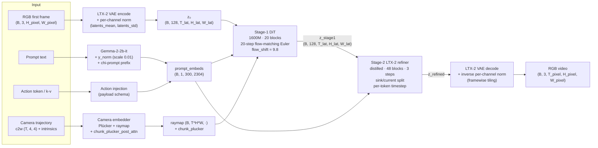
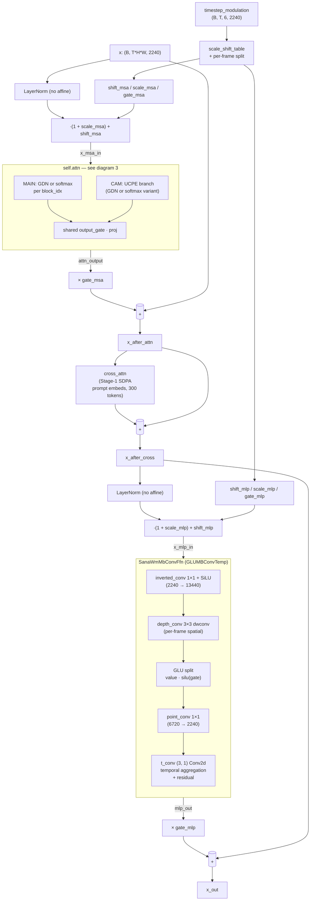
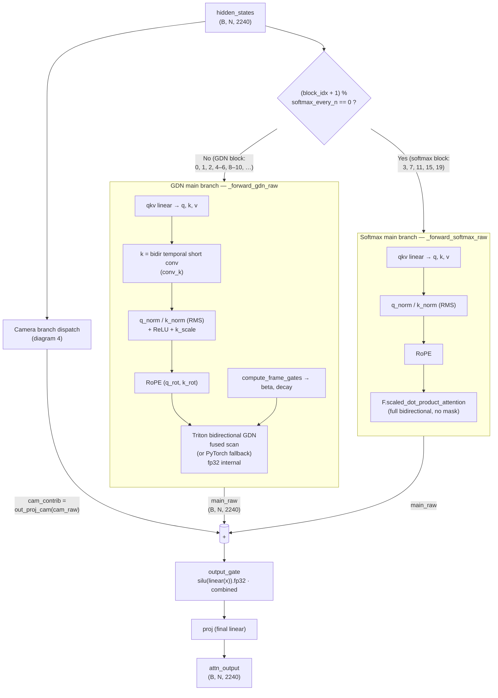
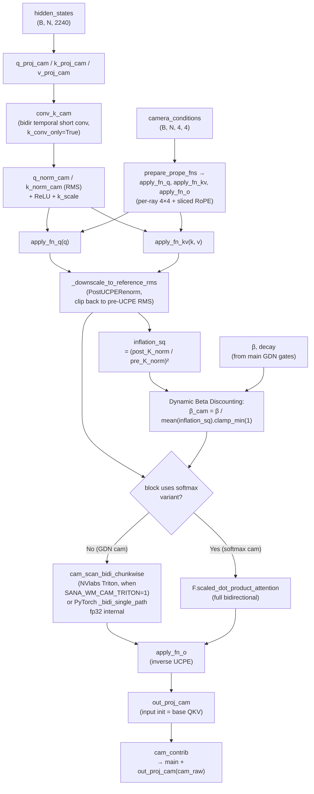
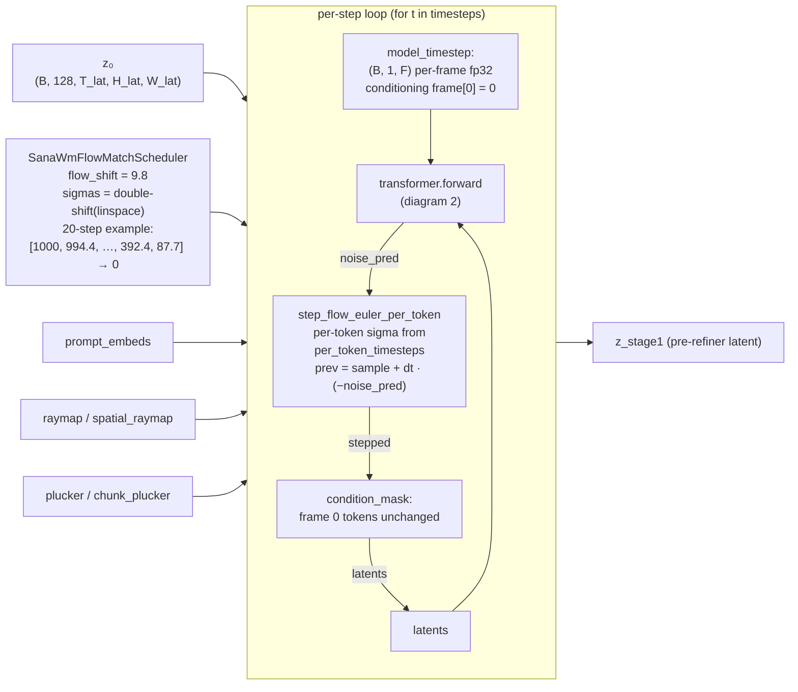
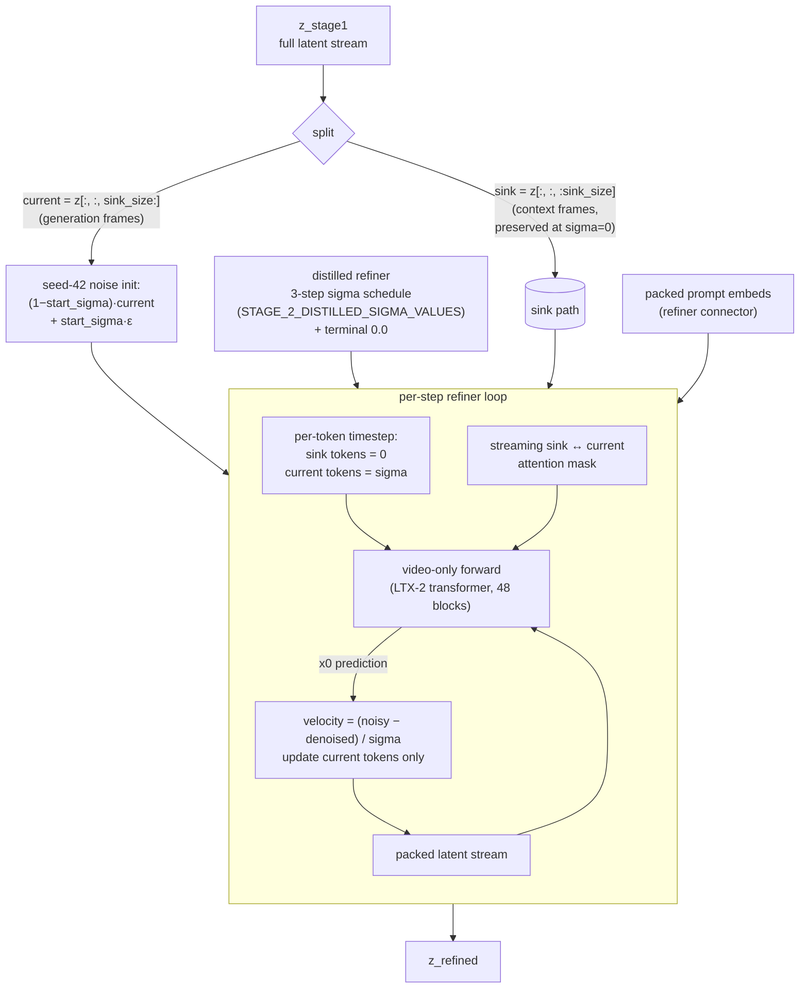

# SANA-WM Architecture Diagrams

Reconstructed from source-reading and parity-probe evidence collected
during the §6.13/§6.14 audit work (see `sana_wm_progress_audit.md`).
Targets the SANA-WM 1600M / 720p release config (`sana_wm_1600m_720p.yaml`).
Shapes use the 9-frame harness as reference: `T_pixel=9`,
`T_latent=2`, `H_pixel=704`, `H_latent=22`, `W_pixel=1280`,
`W_latent=40`, `B=1`, `C_latent=128`, `C_hidden=2240`,
`prompt_tokens=300`, `prompt_dim=2304`.

---

## 1. Top-level pipeline

The `SanaWmTwoStagesPipeline` runs three GPU passes in sequence: Stage-1
DiT denoising, Stage-2 LTX-2 distilled refiner, LTX-2 VAE decode.

Per `sana_wm_progress_audit.md` §6.14a, the LTX-2 VAE decode is not
the dominant error source (Stage-1 RGB MAE ≈ 3, PSNR ≈ 35). §6.14e
showed the dominant remaining gap is the Stage-2 refiner contract.

---

## 2. Stage-1 DiT block — alternating GDN / softmax hybrid

20 transformer blocks, identical macro structure. The
`softmax_every_n = 4` knob splits the camctrl variant per block index
(0-indexed `(i+1) % 4 == 0` → softmax UCPE, else GDN+UCPE). Main
attention class is also swapped accordingly (despite the misleading
`chunk_size` scaffolding documented in `sana_wm_progress_audit.md`
§6.13r — the chunk-causal mask described in NVlabs' docstring is
unimplemented; both variants run full-bidirectional).

Notes:
- §6.13j: block-0 sub-stage cosines are essentially perfect
  (attn cos +0.9999, MLP cos +0.998).
- §6.13m: the softmax-UCPE camera branch was missing in early native
  code; landing it pushed 3-step controlled latent cos from 0.968
  → 0.9925.
- §6.13p: at 321-frame length, every block's same-latent cos is
  still ≈ 1.0; the residual is broadly distributed, no single bad
  block.

---

## 3. Self-attention dispatch (SanaWmSelfAttention)

Two branches feed a shared `output_gate + proj`. Branch selection
depends on `block_idx`:

Empirical findings:
- §6.13r: `chunk_size` scaffolding is wired through `forward_frame_aware`
  but every actual forward implementation swallows it via `**kwargs`.
  `_SoftmaxUCPESinglePathLiteLA`'s docstring claims chunk-causal masking
  exists; the implementation runs unmasked SDPA. NVlabs's
  `ChunkCausalSoftmaxUCPESinglePathLiteLA` is an alias of the same class.
- §6.13l: native scheduler matches NVlabs `FlowMatchEulerDiscrete` timestep
  table bit-for-bit (load-bearing "double-shift" of `sigma_min`).

---

## 4. UCPE camera branches

GDN cam branch (`BidirectionalGDNUCPESinglePathLiteLABothTriton`) and
softmax cam branch (`_SoftmaxUCPESinglePathLiteLA`) share the UCPE
prep, differ only in the inner scan.

§6.12a verified the UCPE math + raw GDN cam branch to `~1e-7` fp32
max-abs vs NVlabs.

---

## 5. Stage-1 multi-step flow-matching Euler

§6.13d/m: per-token Euler + condition_mask + per-frame timestep are
load-bearing. §6.13l: timestep table reproduced from
`FlowMatchEulerDiscreteScheduler` natively, not via DPMSolver wrapper.

---

## 6. Stage-2 LTX-2 refiner — sink / current split

Native refiner ported in commit `0a0ef672...8951e6a4` to follow the
NVlabs `DiffusersLTX2Refiner` contract (§6.14e).

§6.14f acceptance target (still open): `latent_cos_generated ≥ 0.98`,
RGB MAE ≤ 5 vs same-source NVlabs refiner.

---

## 7. Current correctness floor (as of §6.14e)

| Layer | 9-frame harness | 321-frame harness | Notes |
|---|---|---|---|
| Stage-1 latent vs NVlabs | cos +0.992 (§6.13m) | cos +0.7575 (§6.13n) | 321f gap is real and on native side (§6.13u NV self-cos bit-exact) |
| Refiner latent (same-source) | cos +0.89 (§6.14e) | (not measured) | §6.14f remaining work |
| VAE RGB direct | PSNR 35 / SSIM-Y 0.99 | (not measured) | not the bottleneck |
| Full-chain RGB | MAE 22.55 / PSNR 17.72 / SSIM-Y +0.587 (§6.14e) | (not measured) | spec gate: PSNR ≥ 30 / SSIM-Y ≥ 0.93 |

Dead ends already ruled out for the 321-frame gap:
- scheduler timestep table (§6.13l)
- camera Triton dispatch (§6.13p path ablation)
- bf16 vs fp32 of the transformer parameters (§6.13p)
- `chunk_size` chunk-causal masking (§6.13r — unimplemented in NVlabs)
- step-18 sigma-jump subdivision (§6.13s)
- single divergent sub-stage within any DiT block (§6.13p, §6.13u block-level diff)

What remains:
- Per-op kernel-level numerical alignment (RMSNorm reduce order,
  Triton GDN accumulation, ColumnParallelLinear bias add ordering).
  Expensive and broadly distributed; each op contributes < 1 % to
  the cumulative 0.04 same-latent `noise_pred` residual.
- Stage-2 refiner same-source parity (§6.14f) — still open and
  actionable; this is the next high-leverage path for the 9-frame
  spec gate.
